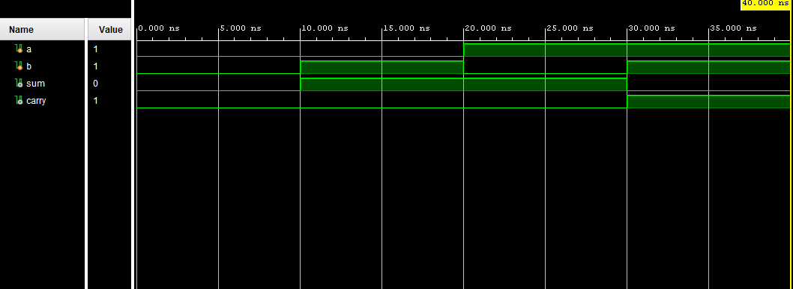

# Half Adder using Verilog HDL

This project implements a Half Adder using Behavioral Modeling in Verilog HDL and simulates it using Xilinx Vivado.

---

# Description

A Half Adder is a combinational circuit used to add two single-bit binary numbers.

It has:
- Two inputs: A and B
- Two outputs:
  - Sum
  - Carry

The Sum output is generated using XOR operation, and the Carry output is generated using AND operation.

---

# Equations

Sum:

S = A ⊕ B

Carry:

C = A · B

---

# Truth Table

| A | B | Sum | Carry |
|---|---|---|---|
| 0 | 0 | 0 | 0 |
| 0 | 1 | 1 | 0 |
| 1 | 0 | 1 | 0 |
| 1 | 1 | 0 | 1 |

---

# Verilog Code

```verilog
module half_adder(
    input A,
    input B,
    output Sum,
    output Carry
);

assign Sum = A ^ B;
assign Carry = A & B;

endmodule
```

# Testbench

```verilog
`timescale 1ns / 1ps

module half_adder_tb;

reg A;
reg B;
wire Sum;
wire Carry;

// Instantiate the Half Adder
half_adder uut (
    .A(A),
    .B(B),
    .Sum(Sum),
    .Carry(Carry)
);

initial begin
    A = 0; B = 0;
    #10;

    A = 0; B = 1;
    #10;

    A = 1; B = 0;
    #10;

    A = 1; B = 1;
    #10;

    $finish;
end

endmodule
```

# Simulation Waveform



---

# Tools Used

- Verilog HDL
- Xilinx Vivado
